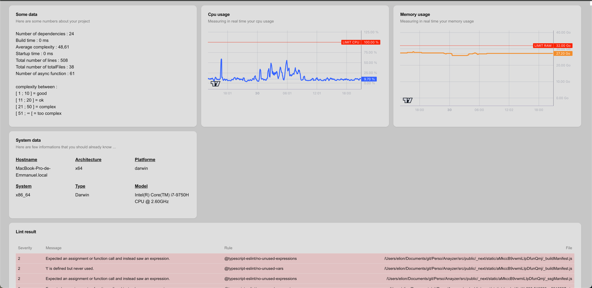

# Anayzer

[link to npm package](https://www.npmjs.com/package/anayzer)



**Anayzer** is a command-line tool (CLI) that quickly analyzes your JavaScript/TypeScript project and provides you with various metrics as well as information on complexity, dependencies and resource usage. It can also help you spot lint problems and get an overall picture of your code's health.

---

## Installation

```bash
npm i anayzer
```

---

## Use

Once the package has been installed, you can launch the analysis of your project using :

```bash
npx anayzer
```

---

## Features

Anayzer provides different types of information and reports:

1. **General statistics**
   - **Number of dependencies**: the number of packages listed in your `package.json` files.
   - **Build time**: the project build (or analysis) time.
   - **Total number of lines**: lines of code (LOC) counted in your project.
   - **Starting time**: time needed to initialize the project or tool.
   - **Total number of handles**: the number of resources or handles (file descriptors, sockets, etc.) opened.
   - **Number of asynchronous functions**: lists `async`/`await` functions in the code.
   - **Complexity index**: an overall indicator of your project's complexity (number of classes, functions, etc.).

2. **System resources**
   - **CPU usage**: measures CPU usage during analysis.
   - **Memory usage**: measures memory used by the tool during execution.
   - **Machine information**: host, architecture, platform, Node.js version, etc.

3. **lint report**
   - Anayzer can list any lint errors or warnings in your code (e.g. ESLint rules).
   - Each message indicates the severity (error or warning), the description and the rule concerned.

4. **Visualization**
   - The result is presented in tabular and graphical form (in the console or via a simplified interface) to help you quickly spot problem areas.

Here's an example interface (simplified):

---

## Examples of use

- **Quick analysis**: get an overview of your project's status before pushing it into production.
- **CI/CD integration**: you can run `npx anayzer` in your pipelines to quickly spot lint problems, check the number of dependencies, etc.
- **Performance audit**: identify if your project is consuming too many resources (CPU or memory) during build or startup.

---

## Contribute

Contributions are welcome! If you'd like to add features, fix bugs or improve documentation, feel free to open a **issue** or **pull request** in the corresponding GitHub repository.

---

## License

Anayzer is distributed under the [MIT](LICENSE) license. You are free to use, modify and redistribute it.

---

**Good use and good analysis of your projects!**
